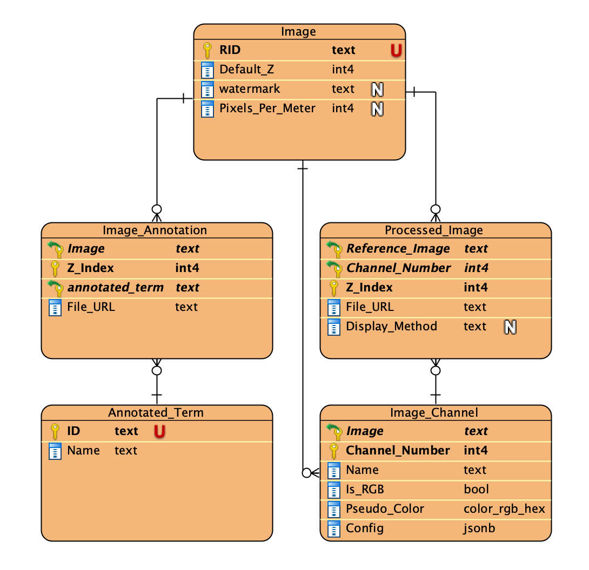

# Viewer app configuration file: viewer-config.js

Upon loading the viewer app, it will make several requests for populating
the data for different portions of the page. To avoid hard coding the requests,
we've deployed a configuration mechanism in this app.

## Model

Before explaining the `viewer-config.js`, let's go over the model.
The following is the assumed model of a fully-configured viewer app:



(All the table and column names are configurable)

- `Image` table is the entry point of the viewer app.
- `Processed_Image` table is the actual table that stores the data for each image channel
  in each z-plane. For example, if an image has two stored z-indices and each one has
  two channels, there will be 4 records of `Processed_Image` table.
- `Image_Channel` table stores the channel information (whether it's greyscale,
  the pseudo color, channel name, and default [channel configuration](#channel-configuration))
- `Image_Annotation` table stores the annotations. It MUST have an asset column used to store the annotation files.
- `Annotated_Term` is the term that each annotation will be associated with.
  For each image in each z-index, there can only be one annotation per term.

## Configuration

To allow flexibility, the configuration file can have multiple configurations.
Each configuration is specified by a given key name. When users go to
the viewer app, we will use the `config` query parameter to determine which
configuration we should use.

The configuration file must be defined under `config/viewer-config.js` and the following is the structure of this config file:
```javascript
var viewerConfigs = {
  <config-name>: <configuration>
};
```
> The variable MUST be defined exactly this way. The viewer app uses this `viewerConfigs` global variable.

Where
- `<config-name>` is a string that will be matched with the given `config` query parameter.
  - `"*"` can be used to indicate the default configuration. If the query parameter is missing or given name wasn't found, this configuration will be used.
- `<configuration>` can be one of the following:
  - Another `<config-name>` to indicate that chaise should use the configuration defined under the other `<config-name>`.
  - An object. The expected structure of the object is explained in the [parameters](#parameters) section.


For example, let's assume the following is how the `viewer-config.js` looks like:

```javascript
var viewerConfigs = {
  "*": <config1>,
  "img1": "img2",
  "img2": <config2>
};
```

Then:
1. Navigating to a page with `?config=img1` query parameter will use `<config2>`.
2. Navigating to a page with `?config=img2` query parameter will also use `<config2>`.
3. Navigating to a page without any `config` query parameters or with `config`
query parameters other than "img1" and "img2", will use `<config1>`.

### Parameters

The parameters are explained in the [`viewer-config-sample.js`](https://github.com/informatics-isi-edu/chaise/tree/master/config/viewer-config-sample.js) file.

## Channel Configuration

As was mentioned in the model section, one of the specified columns in the
`Image_Channel` table is `Config`. This will preserve the values that
will manipulate the displayed colors for each channel. This column is defined as
`jsonb` type with the following expected structure:

```json
{
  "name": "<format-name>",
  "version": "<format-version>",
  "config": {

  }
}

```
> If the Config column is not defined, or the value is not in the expected format, the OSD viewer will use the default values.

Currently, in the viewer app, we're using `"channel-parameters"` as the format name and `"1.0"`
as the version number. And the config attributes are as follows:

<table>
    <tbody>
        <tr>
            <th>Name</th>
            <th>Description</th>
            <th>Acceptable values</th>
            <th>Default value</th>
        </tr>
        <tr>
            <td><strong>black_level_uint8</strong></td>
            <td>
                Used in combination with <em>white_level_uint8</em> to linearly map
                intensity of the pixels in the displayed image. This value defines
                the lower bound of the linear mapping.</br>
                (Must be smaller than <code>white_level_uint8</code>)
            </td>
            <td>Integers in [0, 255] range</td>
            <td>0</td>
        </tr>
        <tr>
            <td><strong>white_level_uint8</strong></td>
            <td>
                Used in combination with <em>black_level_uint8</em> to linearly map
                intensity of the pixels in the displayed image. This value defines
                the upper bound of the linear mapping. </br>
                (Must be bigger than <code>black_level_uint8</code>)
            </td>
            <td>Integers in [0, 255] range</td>
            <td>255</td>
        </tr>
        <tr>
            <td><strong>gamma</strong></td>
            <td>
                Gamma correction. The defined value will be used as
                exponent to modify the intensity of the pixels in the displayed image.
            </td>
            <td>Numbers in [0, 3] range</td>
            <td>
                Default is set based on the channel names:
                <ul>
                    <li>
                        <strong>0.55</strong> for channels that we know the color mapping of them: </br>
                        <code>Alexa Fluor 633</code>, <code>Alexa Fluor 647</code>,
                        <code>Rhodamine</code>, <code>RFP</code>, <code>Alexa Fluor 555</code>, <code>Alexa Fluor 594</code>, <code>tdTomato</code>, <code>mcherry</code>,
                        <code>FITC</code>, <code>Alexa 488</code>, <code>Alexa Fluor 488</code>, <code>EGFP</code>, <code>DAPI</code>, <code>Hoechst</code>
                    </li>
                    <li>
                        <strong>0.875</strong> for any other channels
                    </li>
                </ul>
             </td>
        </tr>
        <tr>
            <td><strong>saturation_percent</strong></td>
            <td>
                (Only applicable to greyscale images) </br>
                Saturation of the pixels in the displayed image.
            </td>
            <td>Numbers in [0, 100] range</td>
            <td>100</td>
        </tr>
        <tr>
            <td><strong>hue_degree</strong></td>
            <td>
                (Only applicable to greyscale images) </br>
                Degree of the hue for the pixels in the displayed image.
            </td>
            <td>Integers in [0, 360] range</td>
            <td>0</td>
        </tr>
        <tr>
            <td><strong>display_greyscale</strong></td>
            <td>
                (Only applicable to greyscale images) </br>
                Set this to <code>true</code> to ignore the given <code>hue_degree</code> and show the
                greyscale image without any hue adjustment.
            </td>
            <td>Boolean</td>
            <td>false</td>
        </tr>
    </tbody>
</table>

So an example of a stored channel config looks like the following:

```json
{
  "name": "channel-parameters",
  "version": "1.0",
  "config": {
      "black_level_uint8": 0,
      "white_level_uint8": 255,
      "gamma": 1,
      "saturation_percent": 100,
      "hue_degree": 0,
      "display_greyscale": false
  }
}
```
