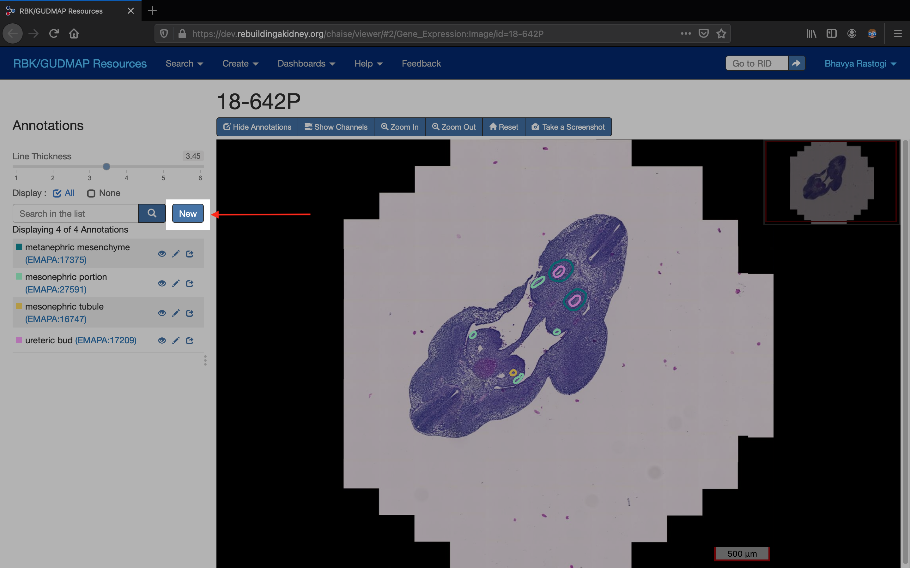
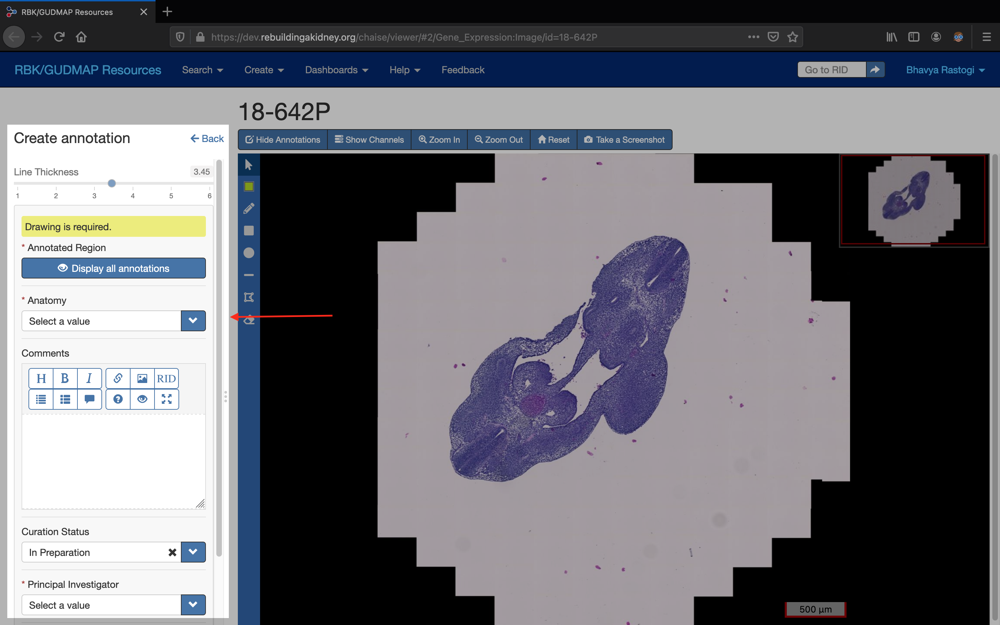
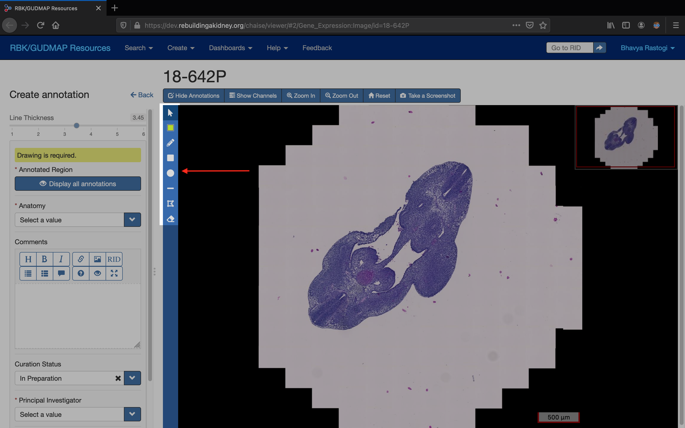
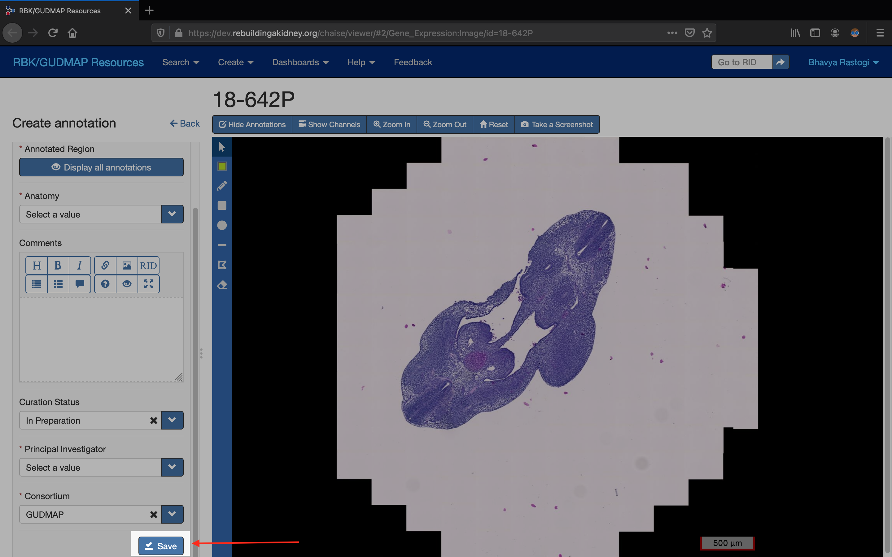
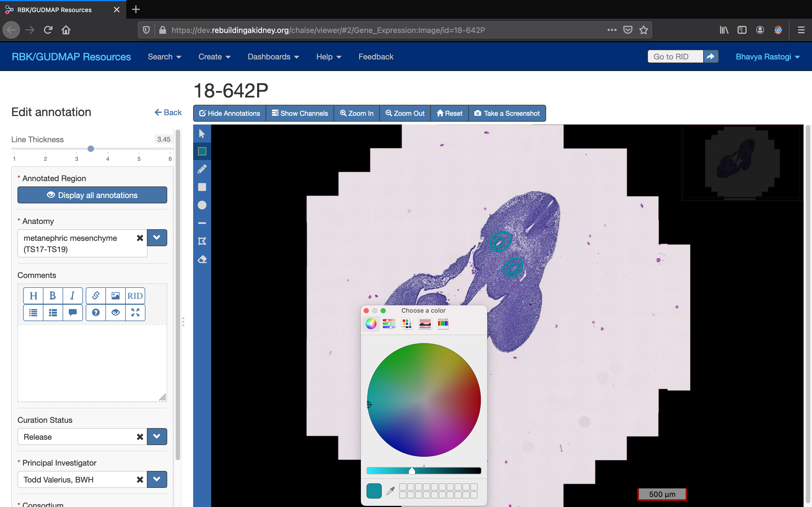
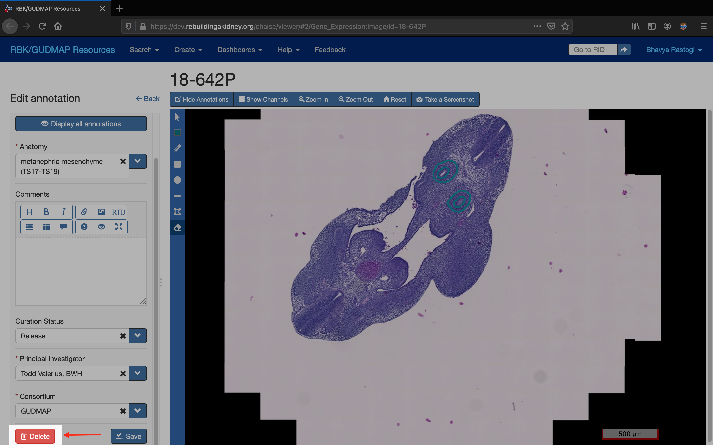
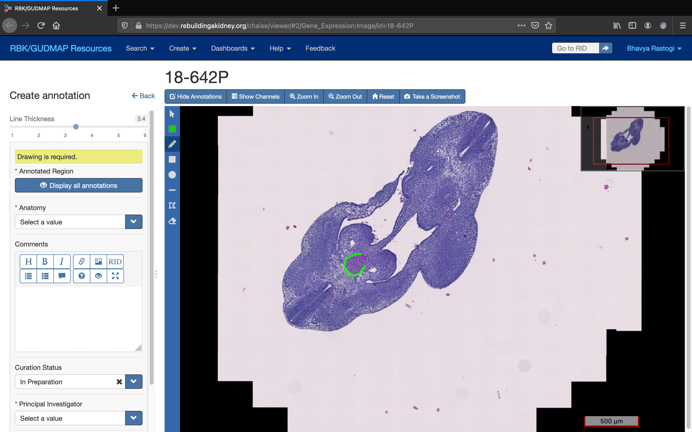
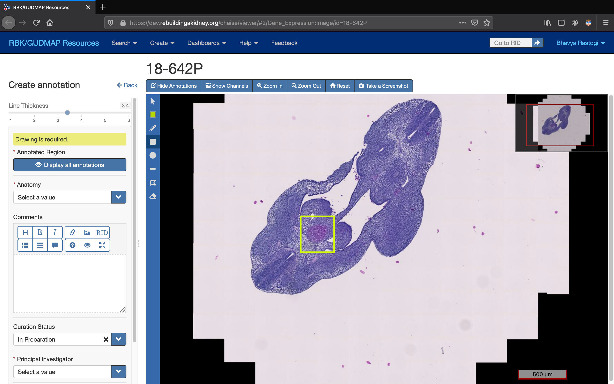

# How to annotate an image {id=how-to-annotate-an-image}

* [Add a new Annotation](#add-a-new-annotation)
* [Edit/Delete an existing Annotation](#editdelete-an-existing-annotation)
* [Draw a Shape](#draw-a-shape)

## Add a new annotation {id=add-a-new-annotation}

1. Make sure that you are logged in.

	{.chaise-help-image}

2. On the left hand side, beside the image you will see a `New` button. Click on it to open the `Create annotation` panel.

	{.chaise-help-image}

	{.chaise-help-image}

3. Fill in the following fields:

	- Select the related anatomical term in the `Anatomy` field. (Required)
	- Enter any useful description of your annotation in the `Comments` field. You may format your text using the formatting icons above the field. (Optional)
	- The `Curation Status` field is `In Preparation` by default, which means it is not viewable to the public. You may change this field to `PI Review` if your lab uses that status for internal review or to `Submitted` to send it to the Hub for biocuration and subsequent release to the public.
	- Select the relevant `Principal Investigator`. (Required)
	- Select the relevant `Consortium`. (Required)

5. Select the desired annotation shape from the `Annotation Toolbar`. You may choose from pencil icon (freehand drawing), rectangle or circle.

	{.chaise-help-image}

6. Draw the shape in the desired location on the image. (You may use multiple and different shapes within the annotation). See [Draw a shape](#draw-a-shape) for more details about the different drawing options.

7. You may de-select the current shape by click on the same shape from the `Annotation Toolbar`.

8. To save your annotation, click on the `Save` button in the `Create annotation` panel.

	{.chaise-help-image}

## Edit/Delete an existing annotation {id=edit-delete-an-existing-annotation}

1. Make sure that you are logged in.

2. Click on the `Edit Annotation` icon of the annotation that you want to edit.

SCREENSHOT

3. To change the color of the annotation, pick a different color from the color picker (red square). This will change the color of all the shapes of the annotation that share the original color.

{.chaise-help-image}

4. To delete a shape from this annotation, select the `Erase` tool from the annotation toolbar and click on the shape that you want to delete.

SCREENSHOT

5. To add a new shape, select the shape that you want from the annotation toolbar and start drawing it on the image.

SCREENSHOT

6. After you are done making your changes, click on the `Save` button in the `Edit annotation` panel.

7. To delete the entire annotation, click on the `Delete` button in the `Edit annotation` panel.

	{.chaise-help-image}

## Draw a shape {id=draw-a-shape}

### Path {id=path}

1. Select the path tool (pencil icon) from the annotation tool bar.
	{.chaise-help-image}

2. Press and hold the left mouse button to draw the path on the image. Drag the mouse to draw the shape.

3. Let go of the mouse button when you are done drawing.

4. To add subsequent paths, repeat steps 2 & 3.

### Rectangle {id=rectangle}

1. Select the rectangle tool (square icon) from the annotation tool bar.

	{.chaise-help-image}

2. Press and hold the left mouse button to draw a rectangle on the image. Start dragging your shape with your mouse from the top-left corner to the bottom right corner of the area you want to annotate.

3. Let go of the mouse button when you are done drawing.

4. To add subsequent rectangles, repeat steps 2 & 3.

### Circle {id=circle}

1. Select the circle tool (circle icon) from the annotation tool bar.

	{.chaise-help-image}

2. Press and hold the left mouse button to draw the circle on the image. Start dragging your shape from the center of the area you want to annotate out to the desired radius.

3. Let go of the mouse button when you are done drawing.

4. To add subsequent circles, repeat steps 2 & 3.
